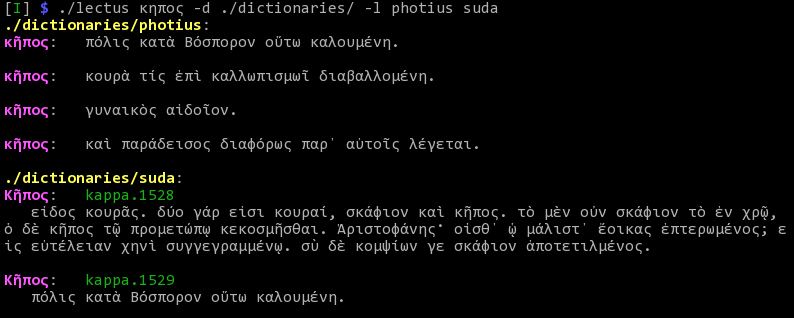

+++++++++++++++++
Lectus
+++++++++++++++++

WORK IN PROGRESS
________________

Description
___________

Lectus is a script to query dictionary files (for the moment, only ABBYY Lingvo
.dsl dictionaries) and display the results in a Linux terminal.

-----------------------------------------------------------------

-----------------------------------------------------------------

Installation
____________

Clone the GitHub repository::

   git clone:https://github.com/proteusx/Lectus.git

Copy or link some .dsl dictionary files into the Lectus directory.

Usage
_____

``lectus DICTIONARY REGEX``

Examples
________

Assuming that you have a copy or a link to the Photius_ lexicon
(file ``photius.dsl``), to search for the lemma ``κηπος``::

      lectus photius κηπος

Τhis will return all the headwords that include the string ``κηπος``.
The search term must be typed without accents.
Searching is always case insensitive.

The search term can be a regular expression like::

  lectus photius κ.*ος

Will return all words that include strings that start with a "**κ**" followed by any number
of characters and end with a "**ς**".

To search the Suda_ lexicon (file ``suda.dsl``) for words like
``κῆπος`` and ``κῆτος``::

 lectus suda \^κη\(π\|τ\)ος

Any Perl like regular expression is acceptable input, provided that symbols that are
significant to the shell, like ``^,|,(,)``, etc. are escaped with a "\".

Lectus displays in alphabetical order the first 20 results that match the query.

When Lectus sees a dictionary for the first time it will generate an index file
(.idx) which records the location of every headword within the .dsl file.
Subsequent queries on the same dictionary will go through this index, find the
headword, read the corresponding index and rapidly locate the answer in the .dsl
file.

.. _Photius: https://github.com/proteusx/Photius-Lexicon
.. _Suda: https://github.com/proteusx/Suda-For-GoldenDict

.. vim: set syntax=rst tw=80 spell fo=tq:

